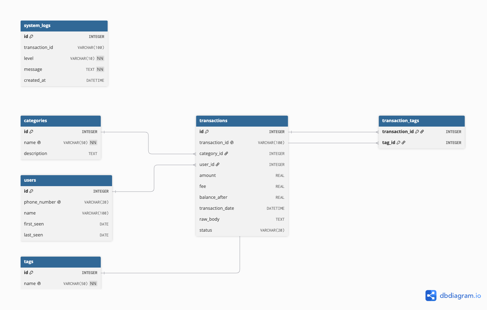
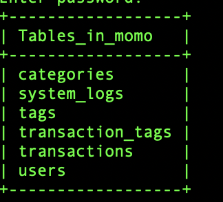
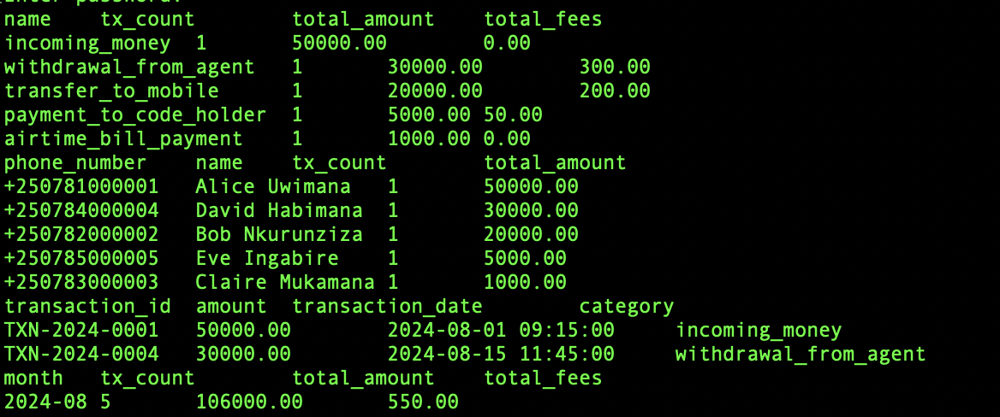
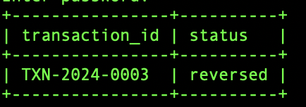
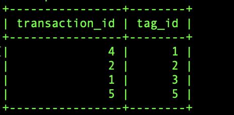
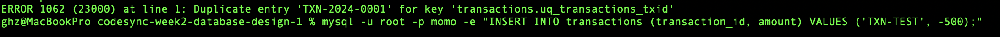
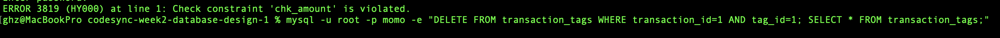

# Database Design Document — MoMo Analytics Platform

**Project:** CodeSync MoMo SMS Data Processing System
**Author:** Chol Mach Kuol Chol
**Branch:** feature/project-lead
**Date:** September 2026

---

## Overview

The MoMo Analytics Platform database is built on MySQL and consists of six
tables designed to store, categorize, tag, and audit every MoMo SMS transaction
extracted from the XML data source. The schema was designed with three priorities
in mind: referential integrity to prevent orphaned or inconsistent records,
query performance through strategic indexing, and full traceability by preserving
the original SMS text alongside every processed transaction.

---

## Design Rationale

**Why a separate `users` table?**
Phone numbers and names appear repeatedly across hundreds of transactions. Rather
than duplicating that data in every transaction row, we extract counterparty
information into a dedicated `users` table. This eliminates redundancy, enables
user-level analytics (total sent, total received, activity range) with simple
JOIN queries, and makes it easy to update a name without touching transaction
records.

**Why a separate `categories` table?**
The MoMo XML data contains 11 distinct transaction types identified through SMS
pattern matching. Storing these as a lookup table rather than raw strings in
`transactions` enforces consistency — a transaction can only belong to a category
that exists — and makes it trivial to add new categories or rename existing ones
without a bulk UPDATE.

**Why `tags` and a junction table?**
Categories capture the primary transaction type (one per transaction). Tags are
flexible, analyst-defined labels such as "high-value" or "flagged" that can be
applied after ingestion. A single transaction can carry multiple tags, and the
same tag applies to many transactions — a many-to-many relationship. The
`transaction_tags` junction table resolves this cleanly with a composite primary
key that also prevents duplicate tag assignments.

**Why store `raw_body`?**
The original SMS text is preserved verbatim in every transaction row. This means
any future improvement to the categorisation regex can be re-applied to historical
data without re-importing the XML source file, and any disputed transaction can
be traced back to its exact original message.

**Why is `transaction_id` in `system_logs` nullable?**
Not every log event relates to a specific transaction. Pipeline-level events such
as startup, file-not-found errors, and schema validation failures need to be
recorded in the same audit trail. Making `transaction_id` nullable in `system_logs`
accommodates both transaction-level and pipeline-level events in one table.

**Indexes strategy:**
Indexes are placed on `transaction_date`, `category_id`, and `user_id` in the
`transactions` table — the columns most frequently used in WHERE clauses and
JOINs. Two indexes on `system_logs` cover `level` (for filtering ERROR entries)
and `created_at` (for time-range queries). This avoids full-table scans on the
two largest tables in the schema.

---

## Entity Relationship Summary

| Relationship | Type | Description |
|---|---|---|
| transactions → categories | Many-to-One (M:1) | Each transaction belongs to one category |
| transactions → users | Many-to-One (M:1) | Each transaction has one counterparty user |
| transactions ↔ tags | Many-to-Many (M:N) | Resolved via `transaction_tags` junction table |
| system_logs → transactions | Many-to-One (M:1) | Many log entries can reference one transaction |





---

## Data Dictionary

### `categories`
Lookup table for the 11 MoMo transaction types. Seeded at schema creation.

| Column | Type | Constraints | Description |
|---|---|---|---|
| id | INTEGER | PK, AUTOINCREMENT | Surrogate key |
| name | VARCHAR(50) | NOT NULL, UNIQUE | Machine-readable transaction type label |
| description | TEXT | | Human-readable explanation of the category |

---

### `users`
Stores unique counterparty phone numbers and names extracted from SMS bodies.

| Column | Type | Constraints | Description |
|---|---|---|---|
| id | INTEGER | PK, AUTOINCREMENT | Surrogate key |
| phone_number | VARCHAR(20) | UNIQUE | Counterparty phone number |
| name | VARCHAR(100) | | Display name extracted from SMS |
| first_seen | DATE | | Date of earliest recorded transaction |
| last_seen | DATE | | Date of most recent transaction |

---

### `transactions`
Core table. One row per MoMo SMS transaction.

| Column | Type | Constraints | Description |
|---|---|---|---|
| id | INTEGER | PK, AUTOINCREMENT | Surrogate key |
| transaction_id | VARCHAR(100) | UNIQUE | MoMo reference number from SMS |
| category_id | INTEGER | FK → categories.id | Transaction type |
| user_id | INTEGER | FK → users.id | Counterparty user |
| amount | REAL | CHECK (amount >= 0) | Transaction amount in RWF |
| fee | REAL | CHECK (fee >= 0) | Service fee in RWF |
| balance_after | REAL | | Account balance after transaction |
| transaction_date | DATETIME | | Timestamp parsed from SMS body |
| raw_body | TEXT | | Original SMS text for traceability |
| status | VARCHAR(20) | CHECK IN ('success','failed','reversed'), DEFAULT 'success' | Transaction outcome |

---

### `tags`
Free-form analyst labels that can be applied to transactions after ingestion.

| Column | Type | Constraints | Description |
|---|---|---|---|
| id | INTEGER | PK, AUTOINCREMENT | Surrogate key |
| name | VARCHAR(50) | NOT NULL, UNIQUE | Tag label e.g. high-value, flagged |

---

### `transaction_tags` *(junction table — resolves M:N)*
Links transactions to tags. A transaction can have many tags; a tag can apply to many transactions.

| Column | Type | Constraints | Description |
|---|---|---|---|
| transaction_id | INTEGER | PK (composite), FK → transactions.id, ON DELETE CASCADE | |
| tag_id | INTEGER | PK (composite), FK → tags.id, ON DELETE CASCADE | |

---

### `system_logs`
Audit trail for ETL pipeline events and per-transaction processing results.

| Column | Type | Constraints | Description |
|---|---|---|---|
| id | INTEGER | PK, AUTOINCREMENT | Surrogate key |
| transaction_id | VARCHAR(100) | nullable | Related MoMo reference (null for pipeline events) |
| level | VARCHAR(10) | NOT NULL, CHECK IN ('INFO','WARNING','ERROR') | Log severity level |
| message | TEXT | NOT NULL | Log message body |
| created_at | DATETIME | DEFAULT CURRENT_TIMESTAMP | Auto-set timestamp |

---

## Sample Queries

### 1. Total amount and fees per category
```sql
SELECT c.name,
       COUNT(*)        AS tx_count,
       SUM(t.amount)   AS total_amount,
       SUM(t.fee)      AS total_fees
FROM transactions t
JOIN categories c ON t.category_id = c.id
GROUP BY c.name
ORDER BY total_amount DESC;
```

### 2. Top 5 users by transaction volume
```sql
SELECT u.phone_number,
       u.name,
       COUNT(*)      AS tx_count,
       SUM(t.amount) AS total_amount
FROM transactions t
JOIN users u ON t.user_id = u.id
GROUP BY u.id
ORDER BY total_amount DESC
LIMIT 5;
```

### 3. All transactions carrying the "high-value" tag
```sql
SELECT t.transaction_id, t.amount, t.transaction_date, c.name AS category
FROM transactions t
JOIN transaction_tags tt ON tt.transaction_id = t.id
JOIN tags tg            ON tg.id = tt.tag_id
JOIN categories c       ON c.id  = t.category_id
WHERE tg.name = 'high-value';
```

### 4. Error log entries from the last 7 days
```sql
SELECT id, transaction_id, message, created_at
FROM system_logs
WHERE level = 'ERROR'
  AND created_at >= NOW() - INTERVAL 7 DAY
ORDER BY created_at DESC;
```

### 5. Monthly transaction totals
```sql
SELECT DATE_FORMAT(transaction_date, '%Y-%m') AS month,
       COUNT(*)      AS tx_count,
       SUM(amount)   AS total_amount,
       SUM(fee)      AS total_fees
FROM transactions
GROUP BY month
ORDER BY month;
```







---

## Security & Unique Constraint Rules

The following rules are enforced at the database layer, independent of application code:

1. `transactions.transaction_id` — **UNIQUE** — prevents the same SMS from being imported twice.
2. `users.phone_number` — **UNIQUE** — ensures one user record per phone number, no duplicates.
3. `categories.name` — **UNIQUE** — prevents duplicate category labels in the lookup table.
4. `tags.name` — **UNIQUE** — prevents duplicate tag labels.
5. `transaction_tags(transaction_id, tag_id)` — **composite PK** — prevents the same tag being applied to the same transaction more than once.
6. `CHECK (amount >= 0)` — rejects negative transaction amounts at insert time.
7. `CHECK (fee >= 0)` — rejects negative fee values at insert time.
8. `CHECK (status IN ('success','failed','reversed'))` — rejects any unknown status string.
9. `CHECK (level IN ('INFO','WARNING','ERROR'))` — rejects invalid log level values.
10. `ENGINE=InnoDB` — enforces all REFERENCES constraints at runtime, preventing orphaned foreign key values.




